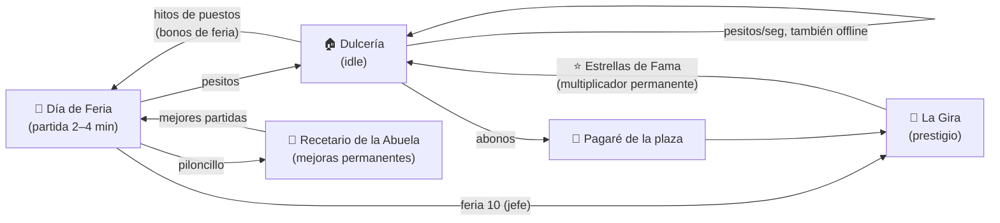

# 03 · Mecánicas

## Mapa de loops

| Loop | Duración | Sensación | Qué gana el jugador |
|---|---|---|---|
| **Toque** (soltar y pegar) | segundos | Satisfacción táctil | Puntos, combos |
| **Día de Feria** (roguelite) | 2–4 min | "Una más" | Pesitos, piloncillo, historia |
| **Dulcería** (idle) | minutos–horas | Ver crecer números | Ingreso pasivo, ayudantes |
| **Región** (capítulo) | 1–3 días | Historia y metas | Nuevos dulces, Estrellas de Fama |

---

## 1. La Dulcería (idle)
Pantalla principal (hub). Vista vertical de la dulcería y la plaza; cada **puesto** es un edificio
que genera **pesitos por segundo**.

### Puestos (región 1)
| # | Puesto | Costo inicial | Razón de costo | Ingreso/seg por nivel | Ayudante |
|:-:|---|--:|:-:|--:|---|
| 1 | Comal de la Abuela | 4 | ×1.07 | 0.8 | Don Chuy |
| 2 | Vitrina de muéganos | 80 | ×1.15 | 4 | Lupita |
| 3 | Carrito de feria | 1.5 K | ×1.14 | 25 | Toño el globero |
| 4 | Mesa en la plaza | 36 K | ×1.13 | 200 | Doña Cleo |
| 5 | Kiosko del jardín | 900 K | ×1.12 | 1,500 | Profe Memo |
| 6 | Taller de cajeta | 25 M | ×1.11 | 12,000 | Tía Rosy |

- **Comprar niveles:** botón con selector **×1 / ×10 / ×100 / Máx**.
- **Hitos de nivel** (25, 50, 100, 200, 300, 400): cada uno **duplica** el ingreso del puesto y
  dispara una celebración (confeti + vecino feliz). Algunos hitos además dan **bonos de feria**:
  - Vitrina nv. 50 → la primera carta de cada feria es al menos *rara*.
  - Carrito nv. 50 → +10 s al Día de Feria.
  - Kiosko nv. 25 → +1 cliente simultáneo en la feria.
- Detalle de fórmulas en [04 · Economía](04-economia.md).

### Ayudantes
- Cada puesto tiene un **vecino ayudante** que se contrata con pesitos (costo = 1,000 × costo inicial
  del puesto; Don Chuy es gratis en el tutorial).
- **Sin ayudante:** el puesto solo produce con la app abierta.
- **Con ayudante:** produce también **fuera de la app** (ganancias offline) y desbloquea diálogos y
  una pequeña animación del vecino.

### Ganancias offline
- Al volver: pantalla *"¡Mientras no estabas!"* con lo ganado y la opción **"Doblar (ver anuncio)"**.
- Tope base: **2 h** de producción. Ampliable con el Recetario (hasta 8 h) y el *Pase de la Abuela* (+4 h).

### Toque en la dulcería (micro-clicker)
- Tocar un puesto le da una venta rápida (+1 s de su producción) con número flotante y "¡clink!".
- **Fiebre de azúcar:** 20 toques rápidos → ×3 a todo el ingreso durante 10 s (enfriamiento 5 min).
  Pensado para sesiones cortas y para que la dulcería no se sienta pasiva.

---

## 2. Día de Feria (partida roguelite)
El corazón del juego. Se entra desde el **mapa de la región** (cada nodo es una feria con objetivo).

### La charola
- Contenedor con física (gravedad, rebote suave, fricción "pegajosa").
- **Tocar** en cualquier punto horizontal → el siguiente mueganito cae desde arriba en esa columna.
- **Enfriamiento de caída:** 0.6 s (reducible con cartas y Recetario).
- **Vista previa** de la siguiente caída (1; el Recetario desbloquea ver 2).
- **Caídas aleatorias** entre tier 1–3 con pesos 60 / 30 / 10 %.
- **Pegarse (merge):** dos mueganitos del **mismo tier** que se tocan se fusionan en el punto medio en
  uno del tier siguiente, con animación de *squish*. Puntos = valor del nuevo tier.
- **Combo:** merges encadenados en menos de 1 s → ×1.5, ×2, ×3…
- **¡Fiesta!:** dos *Megamuéganos* (tier 10) que se juntan explotan en confeti: limpian espacio y dan
  un bono enorme.
- **Desborde:** si un mueganito permanece sobre la línea punteada superior 2 s → *"¡Se desbordó la
  charola!"* → fin de la feria (opción de *Segunda oportunidad* con anuncio o cajeta, 1 vez por feria).

### Clientes y pedidos
- 1–3 clientes en el borde de la charola con burbuja: *"¡Quiero una Torrecita!"*.
- Al **crear** ese tier, el dulce **salta hacia el cliente** y sale de la charola (libera espacio).
- Pago: ×3 los puntos del tier + piloncillo extra (1 por los chicos, más por los grandes). Clientes
  especiales (Profe Memo, Lupita) darán bonos únicos más adelante.
- **Prototipo:** 2 clientes a la vez, paciencia de 32 s (barra verde → naranja → roja), el tier pedido
  sube con las horas (3–5 en la hora 1 hasta 5–8 en la hora 4). Todo en `content/feria.json` → `pedidos`.

### Horas y cartas de Lotería
- Un Día de Feria tiene **4 horas de 40 s** (160 s base; ampliable).
- Entre horas el tiempo se pausa: **elige 1 de 3 cartas de Lotería** (ver sección 3).
- Al terminar la hora 4: **cierre de feria**.

### Final del día y recompensas
| Recompensa | Fórmula | Uso |
|---|---|---|
| **Pesitos** | puntos × máx(1, 0.05 × ingreso/seg de la dulcería) | Puestos y pagaré |
| **Piloncillo** | ⌊√puntos ÷ 5⌋ + bonos de pedidos | Recetario |
| **Listones** (1–3) | según el objetivo de la feria | Progreso del mapa; 3 listones por primera vez = 5 de cajeta |

Así, una feria siempre vale la pena: una feria normal equivale a varios minutos de ventas de la
dulcería, y una excelente a más de 15 minutos.

### Modificadores de feria (variedad)
Tormenta (charola resbalosa) · Sabotaje de Dulcibot (gomitas que no se pegan) · Noche de verbena
(caídas más rápidas, ×2 puntos) · Charola chica · Pedido VIP (un cliente pide un tier muy alto).

---

## 3. Cartas de Lotería (mejoras dentro de la partida)
Cartas ilustradas al estilo de la Lotería mexicana. Se pierden al terminar la feria (roguelite);
desbloquear nuevas cartas para el "mazo" es parte de la meta-progresión.

| Carta | Rareza | Efecto (apilable salvo indicación) |
|---|---|---|
| El Comal | Común | Caídas 15 % más rápidas |
| La Canela | Común | Merges de tier ≥ 4 dan +30 % puntos |
| La Campana | Común | +15 s al Día de Feria |
| La Abuelita | Común | Cae un mueganito automático cada 6 s (cada copia reduce 1 s) |
| La Cajeta | Común | +10 % de chance de que una caída sea un tier más alto |
| El Globero | Común | Cada 20 s un globo se lleva el mueganito más pequeño |
| El Abuelo | Común | Ves 2 caídas siguientes (no apilable) |
| La Talavera | Común | Merges que tocan la pared dan +50 % puntos |
| El Raspadito | Común | Al elegirla, raspas para revelar 1 de 3 bonos pequeños |
| El Cazo | Rara | La charola es 10 % más ancha |
| La Miel | Rara | Mueganitos iguales se atraen suavemente |
| La Estrella | Rara | Combos suben un escalón extra |
| El Mariachi | Rara | +5 % puntos por cada tier distinto en la charola |
| El Cohete | Rara | Cada merge de tier ≥ 7 lanza un cohete: ×2 puntos por 5 s |
| La Piñata | Rara | Aparece una piñata; 10 toques la rompen y sueltan 5 Parejitas |
| El Piloncillo | Rara | +1 piloncillo por cada tier ≥ 6 creado |
| El Sol | Legendaria | Los últimos 30 s del día valen ×2 |
| La Olla de Barro | Legendaria | Al crear un tier 9 aparece un **Muégano Dorado** (×5 puntos) |
| La Sirena | Legendaria | Un pedido aleatorio se cumple solo cada hora |

- Probabilidad base por carta ofrecida: común 70 %, rara 25 %, legendaria 5 %.
- **Re-roll:** 1 gratis por feria si se desbloquea en el Recetario; extra con anuncio o cajeta.
- **Sin apuestas:** no hay cartas de "doble o nada" para cuidar la clasificación por edades.

---

## 4. Recetario de la Abuela (meta-progresión)
Árbol de mejoras permanentes que se compra con **piloncillo**. Visualmente es un cuaderno de recetas
con páginas que se van llenando (las páginas del abuelo desbloquean ramas nuevas).

| Rama | Ejemplos de nodos (niveles) | Costo por nivel |
|---|---|---|
| **Charola** | Charola más ancha (I–III) · Caídas de tier más alto (I–III) · Ver 2 caídas · Fricción pegajosa | 5 → 10 → 20 → 40 → 80 → 160 |
| **Feria** | +10 s por día (I–III) · 4 cartas para elegir · 1 re-roll gratis · Empezar con 1 carta común · Rareza + | 10 → 25 → 60 → 150 → 400 |
| **Dulcería** | +10 % ingreso (I–V) · Tope offline 3/4/6/8 h · Ayudantes 20 % más baratos | 8 → 20 → 50 → 120 → 300 |
| **Pueblo** | +1 piloncillo por pedido · Más clientes · Desbloquear cartas nuevas al mazo | 15 → 40 → 100 → 250 |

- El primer nodo se puede comprar al terminar la primera feria (≈ 10 de piloncillo).
- El jefe de la región 1 (tier 9) debe ser alcanzable con ~300–500 de piloncillo invertido
  (≈ día 2 de juego).

---

## 5. La Gira (prestigio)
**Requisitos:** ganar la feria 10 de la región **y** pagar el pagaré de la plaza.

| Se reinicia | Se conserva |
|---|---|
| Pesitos | Recetario de la Abuela |
| Niveles de puestos | Cajeta (premium) y cosméticos |
| Ayudantes (llegan vecinos nuevos) | Álbum y cartas desbloqueadas |
| Boost de anuncios activos (se pausan y se reanudan) | **Estrellas de Fama** |

- **Estrellas de Fama** = ⌊ √( pesitos ganados en la región ÷ (2×10⁸ × factor de región) ) ⌋.
- Cada estrella: **+2 % ingreso de la dulcería** y **+1 % puntos de feria**, para siempre.
- La pantalla de Gira muestra cuántas estrellas ganarías *ahora* y cuántas si esperas (decisión clara).
- Cada región nueva: nueva familia de dulces, nuevos puestos y vecinos, costos e ingresos ×1,000.
- Al completar todas las regiones disponibles, "Irse de Gira" reabre la última región como
  **Temporada nueva** (prestigio infinito).

---

## 6. Sistemas de retención
| Sistema | Descripción |
|---|---|
| **Cofre de la Feria** (diario) | Recompensa diaria con racha de 7 días (pesitos → piloncillo → cajeta el día 7). |
| **Misiones diarias** (3) | "Crea 5 Torrecitas", "Sube el Comal 10 niveles"… Recompensa: piloncillo y cajeta. |
| **Álbum** | Fichas de cada dulce y vecino. Completar una familia: +5 % puntos de feria permanente. |
| **Eventos de temporada** | Día de Muertos (calaveritas de azúcar), Fiestas Patrias, Posadas, Candelaria, Día del Niño: familia temporal, cartas y cosméticos exclusivos. |
| **Feria Relámpago** (post-lanzamiento) | Feria semanal con semilla fija y tabla de puntajes entre amigos. |
| **Notificaciones** (opt-in) | "¡Tu dulcería llenó la caja!" al llegar al tope offline; máximo 1–2 al día. |

---

## 7. Ideas pendientes (anotadas para después)

### Energía para entrar a la feria
*Propuesta del equipo, aún no implementada.*

- El jugador tiene **100 de energía** (tope). Entrar a un Día de Feria cuesta **10–15**.
- La energía se **recarga sola con el tiempo** y se puede recargar **viendo un anuncio** (ver
  [05 · Monetización](05-monetizacion.md#anuncios-recompensados)).
- Puntos a decidir al implementarla:
  - Ritmo de recarga (referencia: 1 punto cada 3 min ≈ una feria cada 30–45 min de espera).
  - Cuánto da un anuncio (referencia: +30, máximo 3–5 al día) y si la cajeta también recarga.
  - Si las primeras ferias de la región (tutorial) y repetir ferias ya ganadas cuestan menos o nada.
  - Cuidado con el pilar *"Respeta el tiempo del jugador"*: si la energía corta la sesión demasiado
    pronto, baja la retención. Conviene medirlo en el soft launch (sesiones por día, % que se queda sin
    energía, anuncios vistos para recargar).
