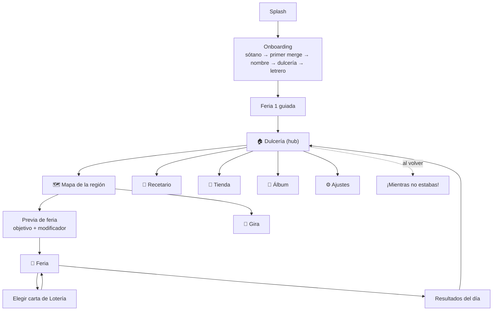

# 06 · UX y pantallas

## Principios
- **Vertical, una mano:** acciones principales en el **tercio inferior** (zona del pulgar). El tercio
  superior es para información (HUD) y narrativa.
- **Áreas seguras:** respetar *notch*, isla dinámica e indicador de inicio (iOS) y barras de Android.
- **Botones grandes:** mínimo 48×48 dp (≈ 132 px en el lienzo de 1080 px).
- **Legibilidad:** texto mínimo 28 px en el lienzo base; contraste AA. Opción de texto grande.
- **Retroalimentación inmediata:** todo toque tiene sonido, animación y (opcional) vibración ligera.
- **Lienzo de diseño:** 1080 × 1920 px (9:16) como zona segura; fondos extendidos a 1080 × 2400 px para
  pantallas más altas.

## Flujo de pantallas



## Barra inferior de navegación
`🏠 Dulcería · 🗺️ Feria · 📖 Recetario · 📒 Álbum · 🛒 Tienda`
El botón central (**Feria**) es el más grande y "late" cuando hay una feria nueva disponible.

## Wireframes

### Dulcería (hub)
```
┌──────────────────────────────┐
│ 🪙 1.4 M  (+3.2 K/s)   🍯 120 │  ← HUD: pesitos, ingreso, cajeta
│ [📺 ¡Feria doble! 3:42:10]    │  ← boost activo / botón para activarlo
├──────────────────────────────┤
│   ~ papel picado ~            │
│   [ LETRERO: Los Pegaditos ]  │
│                               │
│  ┌─────────┐  ┌─────────┐     │
│  │ Comal   │  │ Vitrina │     │  ← puestos ilustrados (scroll vertical)
│  │ Nv 54   │  │ Nv 12   │     │
│  │ ▓▓▓░ 25 │  │ ▓░░░ 25 │     │  ← barra al siguiente hito
│  │[+1 🪙58]│  │[+1 🪙1K]│     │
│  └─────────┘  └─────────┘     │
│  ┌─────────┐  ┌─────────┐     │
│  │ Carrito │  │ 🔒 Mesa │     │
│  └─────────┘  └─────────┘     │
│        [ ×1 | ×10 | ×100 | Máx ] │
├──────────────────────────────┤
│ 🏠    🗺️(FERIA)    📖   📒   🛒 │
└──────────────────────────────┘
```

### Feria (partida)
```
┌──────────────────────────────┐
│ Hora 2/4  ⏱ 0:31   ⭐ 4,520   │  ← tiempo, puntaje
│ 🃏 El Comal · La Canela       │  ← cartas activas (iconos)
├──────────────────────────────┤
│ 🧑‍🦳"¡Una Torrecita!"   Sig: ●  │  ← cliente con pedido · siguiente caída
│ - - - - - - - - - - - - - - - │  ← línea de desborde
│ │                           │ │
│ │        ●                  │ │
│ │   ◉     ●●    ◎           │ │  ← charola con física
│ │  ◎◎  ⬤    ◉  ●●           │ │
│ │ ⬤⬤◎◉●◎⬤◉◎●●◉⬤◎●◉◎⬤      │ │
│ └───────────────────────────┘ │
│     👆 toca para soltar        │
└──────────────────────────────┘
```

### Elegir carta de Lotería
```
┌──────────────────────────────┐
│     ¡Fin de la hora 2!        │
│   Elige una carta de Lotería  │
│ ┌──────┐ ┌──────┐ ┌──────┐    │
│ │  12  │ │  27  │ │  05  │    │  ← número estilo Lotería
│ │ (ilu)│ │ (ilu)│ │ (ilu)│    │
│ │EL    │ │LA    │ │EL    │    │
│ │COMAL │ │MIEL  │ │SOL   │    │
│ │común │ │ rara │ │legend│    │  ← borde por rareza
│ └──────┘ └──────┘ └──────┘    │
│  [🔄 Cambiar (📺)]            │
└──────────────────────────────┘
```

### Resultados del día
- Puntaje con conteo animado → listones (1–3) → pesitos y piloncillo ganados.
- Pedidos cumplidos, tier más alto, mejor combo.
- Botones: **Volver a la dulcería** · **Jugar otra feria** · (si aplica) *Doblar piloncillo 📺*.

### Mapa de la región
- Camino serpenteante por el pueblo con 10 nodos (ferias) y burbujas de historia.
- Barra del **Pagaré de la plaza** arriba con botón **Abonar**.
- Nodo 10 (jefe) con Dulcibot y el espectacular de DulciMax.

### Otras pantallas
| Pantalla | Contenido clave |
|---|---|
| **¡Mientras no estabas!** | Ganancias offline, botón *Doblar (📺)*, ayudantes que trabajaron |
| **Recetario** | Cuaderno con 4 pestañas (ramas); nodos con costo en piloncillo |
| **Álbum** | Fichas de dulces, vecinos y cartas; progreso por familia |
| **Tienda** | Ofertas destacadas, paquetes de cajeta, cosméticos, *Restaurar compras* |
| **Gira** | Estrellas que ganarías ahora vs. después; qué se conserva y qué no |
| **Ajustes** | Sonido, música, vibración, notación numérica, idioma, privacidad, créditos |

## Accesibilidad
- Modo daltónico: cada tier tiene **forma y número**, no solo color.
- Opción "sin vibración" y "reducir partículas".
- Pausa en cualquier momento de la feria.
- Toda la historia se puede releer en el Álbum.
